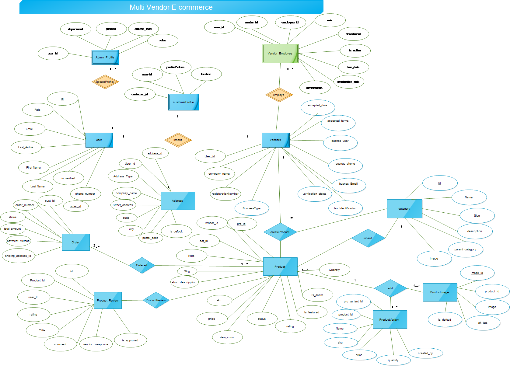
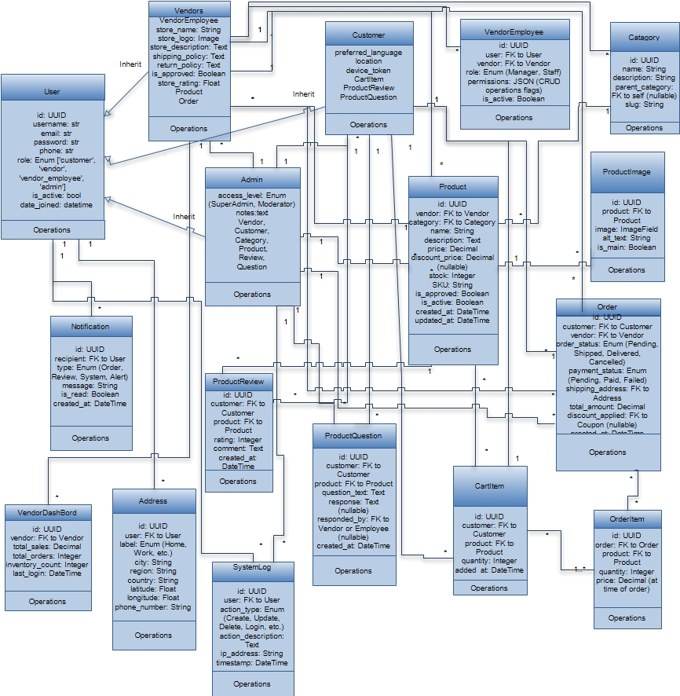

# Multivendor E-Commerce Platform - Backend API Documentation
## Overview
This backend system powers a full-featured multivendor e-commerce platform with comprehensive product management capabilities. Built with Django REST Framework, it provides secure, scalable APIs for marketplace operations including product catalog management, inventory control, customer reviews, and geolocation-based discovery.

## Core Modules
1. Product Catalog System
Endpoints:

GET /api/products/ - Browse products with advanced filtering

GET /api/products/featured/ - Featured products

GET /api/products/popular/ - Most viewed products

GET /api/products/above_rating/ - Products above rating threshold

GET /api/products/nearby/ - Location-based product discovery

## Features:

Multi-level category hierarchy

Product variants and options

Advanced search and filtering

Location-based product Searching

Caching for high performance

Automated view counting

2. Product & Variant Management Endpoints:

GET /api/variants/ - Product variant management

POST /api/variants/ - Create new variants

Dynamic Products  tracking feature

Features:

SKU management

Stock level tracking

Price variations

Automated cache invalidation

3. Media Management
Endpoints:

GET /api/product-images/ - Product image gallery

POST /api/product-images/ - Upload new images

### Features:

Multiple image support per product

Automatic thumbnail generation

Cloud storage integration

4. Ratings & Reviews Endpoints:

GET /api/reviews/ - Product reviews
POST /api/reviews/ - Submit new review

## Vendor response system

Features:
5-star rating system
Review moderation
Vendor responses
Automated rating calculations

5. Q&A System Endpoints:
GET /api/questions/ - Product questions
POST /api/questions/ - Submit new question
Vendor answer system
## Features:
Question moderation
Vendor responses
Technical Architecture
Performance Optimization
## Redis Caching:
Product listings cached with 15-minute TTL
Category data cached for 24 hours
Review/Question data cached for 30 minutes
Automatic Cache Invalidation:
Signals-based cache clearing on data changes
Pattern-based cache deletion
## Query Optimization:

Selective field loading
Prefetch related data
Database indexing
Geolocation Features
Haversine formula for distance calculations
Nearby vendor discovery
Location-based product filtering
Radius search (default 50km)
Security Implementation
JWT authentication

## Role-based permissions:
Customers
Vendors
Vendor employees
Administrators
Input validation
Secure file uploads
Deployment
Requirements
Python 3.12+

PostgreSQL 12+
Redis 6+
Django 5.2+

## Setup Configure environment variables
asgiref==3.9.1
Django==5.2.4
django-cors-headers==4.7.0
django-filter==22.1
django-js-asset==3.1.2
django-mptt==0.17.0
django-redis==6.0.0
djangorestframework==3.16.0
djangorestframework_simplejwt==5.5.1
drf-yasg==1.21.10
inflection==0.5.1
mysqlclient==2.2.7
packaging==25.0
pillow==11.3.0
PyJWT==2.10.1
python-dotenv==1.1.1
pytz==2025.2
PyYAML==6.0.2
redis==6.2.0
sqlparse==0.5.3
tzdata==2025.2
uritemplate==4.2.0

Run migrations: python manage.py pip install -r requirement.txt 

Start server: python manage.py runserver

## CI/CD Pipeline
Automated testing
Docker containerization
Kubernetes orchestration

## Integration Ecosystem
Payment Processing
Chapa payment gateway integration
Split payment settlements
Payout scheduling
## Third-Party Services
Email/SMS notifications
Shipping API integrations
Tax calculation services
CDN for media delivery
Monitoring & Analytics
Prometheus metrics collection

## Grafana dashboards:

Product performance
Review sentiment
Inventory trends
Request logging
Error tracking
Scalability
Tested to 10,000 requests per second
Database sharding ready
Read replica support

## ER-Diagram

## class diagram
